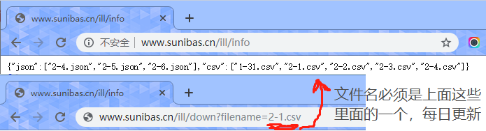
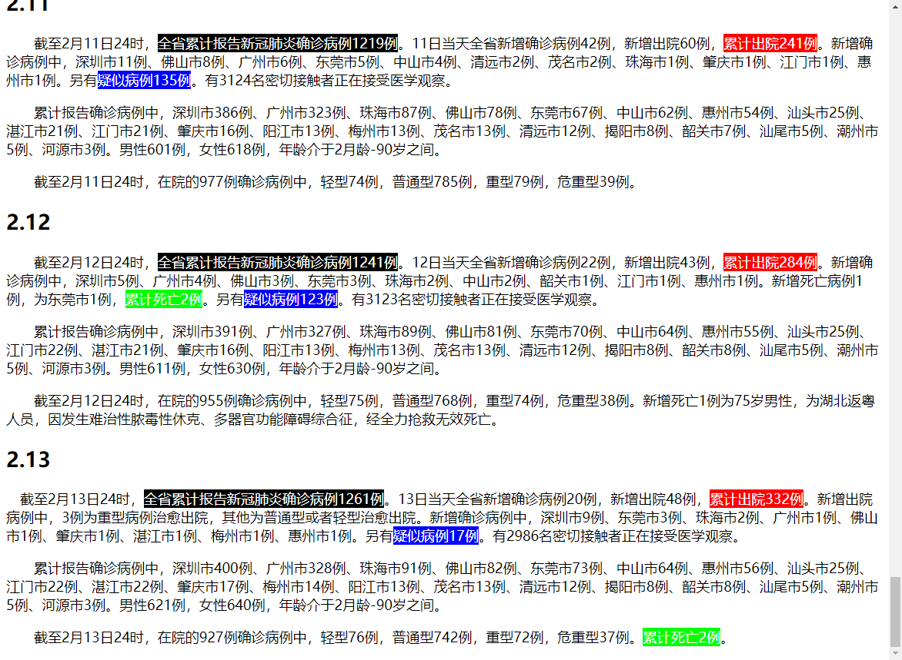
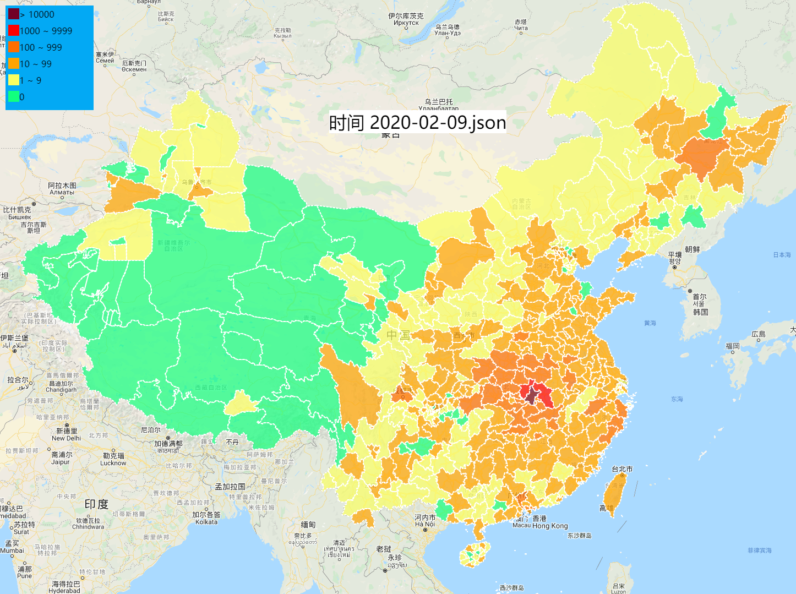
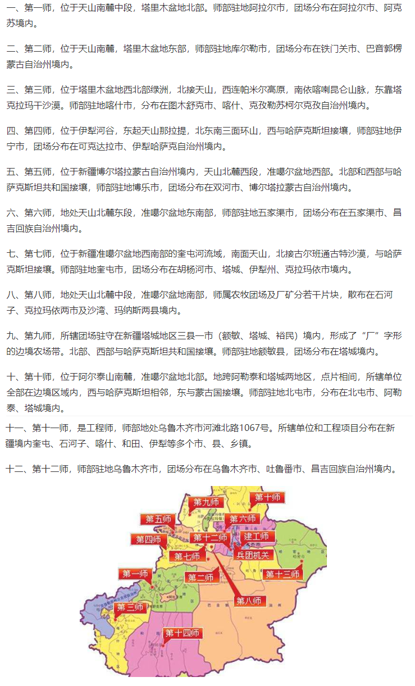

# 2019-nCoV-Datas

## 疫情每日数据记录

> 今日开始加入处理才知道数据获取很难，今后一定要及时掌握数据

> 新增两个接口 [查询数据接口](http://www.sunibas.cn/ill/info) 和 [下载接口](http://www.sunibas.cn/ill/down?filename=)



## 今天（2020年2月14日14点18分）新增官方数据，这个数据来自各个层级的卫生健康委员会(officalData)

- 可以启动服务 ```node serve.js``` 然后访问 ```http://localhost:3000```



## 今天（2020年2月11日14点21分）开始放弃使用 csvFile 数据，理由是对比多方数据后发现偏差过大

## 今天（2020年2月10日22点31分）做数据处理时，发现和其他人数据有出入，故添加以下内容

- 添加 ToTestMyData 目录，内容说明如下

```javascript
// checkMyDataAndNetData.json.js 是用来对比GitHub上另一个项目的数据和我最终生成的 data_json 中的数据的
// 该项目地址是 https://github.com/globalcitizen/2019-wuhan-coronavirus-data
// 其中我把该项目中下载的数据放在了test文件目录下，并筛选出每日的最后一个提交文件
// 例如 20200202-1103 和 20200202-1503 我会保留 1503

// 挑选的代码是 filter.js

// getNameCode.js 是将得到省市名对应的行政编码，然后存到文件netDataJson.json 中

// checkNameCode.js 是检查 netDataJson.json 中的名字代码是否完全覆盖了

// remendMyData.js 将该项目的数据认为是完全正确的，将其差异写入到我的 json 文件中，并重新统计省级数据
```

## 项目内容说明

- 使用该项目不需要额外安装其他包，只需要一个 nodejs，为了方便大家跑起里面的内容，没有使用到 npm 去添加任何依赖包

- source 是原始数据，数据来源如下

> 其中 all.txt 是项目中的 Wuhan-2019-nCoV.csv 文件，但是根据 ISSUE 反馈，从 1-31 开始数据就出现问题，估计是爬取对象修改了接口

> csvFile 文件为项目的 DXYArea.csv 文件，爬取方式是每天定时爬取，也可以从 commits 中获取历史项目

> jsonFile 是我的服务器每日定时(每十分钟)写一个文件(mm-dd.json)进行覆盖，并每日留有最后一份。

> 个人还是不推荐用 csvFile ，理由见[处理代码](source\dearCsv.js)即可，虽然很推荐 all.txt 但是没有更新了

|数据(❌表示放弃使用)|来源|
|:--|:--|
|all.txt|[GitHub项目：Wuhan-2019-nCoV](https://github.com/canghailan/Wuhan-2019-nCoV)|
|❌csvFile\所有csv|[GitHub项目：DXY-2019-nCoV-Data](https://github.com/BlankerL/DXY-2019-nCoV-Data)|
|jsonFile\所有json|百度疫情地图|

- 脚本说明

|脚本|说明|
|:--|:--|
|source\dear_all.js|用于处理 all.txt 文件|
|source\dearCsv.js|用于处理 csvFile 中的文件|
|source\dearJson.js|用于处理 jsonFile 中的文件|
|source\ _json.js|用于将 datas 中的内容转换为 json 并以[行政代码]为[键]|
|source\toBeFormat.js|用于将只有区的没有市，只有市没有省的数据进行补全|
|getChinaChange.js|用于获取截至到目前为止最新的疫情统计数据(全国)|
|downCsv.sh|定时任务脚本，但是要自己设定，设定方式在#里|
|autoRefleshAndDear.js|自动从服务器下载和处理每日数据|

- extend 目录说明

> 里面是一个服务，2019-12-01-2020-02-08.mp4 是我录制的一个视频，而html里面是服务，用于展示该项目中所有时间段内地数据在地图上的显示

```
web
│  makeOneMapJson.js    执行这个文件可以同步 html/out 内的json
│  serve.js             执行这个服务后，在本地访问 localhost:3000
│
└─html
    │  index.html       页面内容，当前动画只显示 1-18 号开始的确诊情况
    │                   (如果有需要可以自行修改，说明一点，我这个代码效率极低)
    ├─leaflet@1.6.0     地图组件
    │      leaflet.css
    │      leaflet.js
    │
    └─out               地图显示的确诊数据
            2019-12-01.json
            2019-12-02.json
这里需要说明一点，如果想要更新 out 里面的数据到当前日期
可以在项目根目录下运行以下命令
node autoRefleshAndDear.js  :: 更新每日疫情数据到本地
node extend/web/makeOneMapJson.js :: 更新地图数据
```



- autoRefleshAndDear.js 脚本说明

```javascript
// 因为 csv 数据是从 1-31 开始
// 而 json 数据是从 2-4 开始，存在交集
// 这部分代码我没有使用 _dcsv 现在已经不想支持 csv 的数据了，错误过多
const dearFiles = () => {
    _djson(basePath,norepeat,function () {
        _json(basePath,norepeat,function () {
            //lastTask();
            console.log("完成");
        });
    })
};
```


- 定时执行命令行 autoRefleshAndDear.exe 源码

> 使用方法 autoRefleshAndDear 间隔时间(ms) 命令行

```c++
// 这个软件的目的是定时执行任务，因为懒得再服务器配置GitHub同步
#include <stdlib.h>
#include <Windows.h>
#include <string>
#include <stdio.h>
#define _CRT_SECURE_NO_WARNINGS
int main(int argc, char* argv[]) {
	if (argc != 3) {
		printf("调用方式为: 程序名 times command\r\ntimes\t表示没间隔多长时间执行一次 command");
		return 0;
	}
	unsigned long times = std::stoul(argv[1]);
	while (true) {
		system(argv[2]);
		Sleep(times);
	}
	return 0;
}
```

- 转换编码 converter.exe 源码

> 编写理由，node 无法正常保存含中文的文件，在windows系统下会出现乱码问题，可以使用 type 命令查看即知

> 使用方法 converter inputFile outputFile 或 converter file

```c++
#include <stdio.h>
#include <locale>
#include <codecvt>
#include <iostream>
#include <fstream>
#include <vector>

const std::wstring utf8_2_ws(const std::string& src)
{
	std::wstring_convert<std::codecvt_utf8<wchar_t> > conv;
	return conv.from_bytes(src);
}

//wstring=>string
std::string WString2String(const std::wstring& ws)
{
	std::string strLocale = setlocale(LC_ALL, "");
	const wchar_t* wchSrc = ws.c_str();
	size_t nDestSize = std::wcstombs(NULL, wchSrc, 0) + 1;
	char *chDest = new char[nDestSize];
	memset(chDest, 0, nDestSize);
	std::wcstombs(chDest, wchSrc, nDestSize);
	std::string strResult = chDest;
	delete[]chDest;
	setlocale(LC_ALL, strLocale.c_str());
	return strResult;
}
// string => wstring
std::wstring String2WString(const std::string& s)
{
	std::string strLocale = setlocale(LC_ALL, "");
	const char* chSrc = s.c_str();
	size_t nDestSize = mbstowcs(NULL, chSrc, 0) + 1;
	wchar_t* wchDest = new wchar_t[nDestSize];
	wmemset(wchDest, 0, nDestSize);
	mbstowcs(wchDest, chSrc, nDestSize);
	std::wstring wstrResult = wchDest;
	delete[]wchDest;
	setlocale(LC_ALL, strLocale.c_str());
	return wstrResult;
}

void DearOneFile(char * inputFile) {
	std::ifstream infile;
	infile.open(inputFile);
	if (!infile.is_open()) {
		std::cout << "文件无法打开" << std::endl;
		return;
	}
	std::string instr;
	std::vector<std::string> out;
	while (!infile.eof()) {
		infile >> instr;
		out.push_back(WString2String(utf8_2_ws(instr)));
	}
	infile.close();
	std::ofstream outfile;
	outfile.open(inputFile);
	for (auto line = out.begin(); line != out.end(); line++) {
		outfile << *line << std::endl;
	}
	outfile.close();
}

void DearTwoFile(char * inputFile, char * outputFile) {
	//char * inputFile = argv[1];// "C:\\Users\\HUZENGYUN\\Documents\\git\\文档\\2019-nCoV-Datas\\datas\\2019-12-01.txt";
	//char * outputFile = argv[2];// "C:\\Users\\HUZENGYUN\\Documents\\git\\文档\\2019-nCoV-Datas\\datas\\2019-12-01.out.txt";
	std::ifstream infile;
	std::ofstream outfile;
	infile.open(inputFile);
	outfile.open(outputFile);
	if (!infile.is_open()) {
		std::cout << "文件无法打开" << std::endl;
		return;
	}
	std::string instr;
	std::string outstr;
	while (!infile.eof()) {
		infile >> instr;
		outstr = WString2String(utf8_2_ws(instr));
		outfile << outstr << "\r\n";
	}
	infile.close();
	outfile.close();
}

int main(int argc, char* argv[]) {
	if (argc == 2) {
		DearOneFile(argv[1]);
	} else if (argc == 3) {
		DearTwoFile(argv[1], argv[2]);
	}
	else {
		std::cout << "程序名 输入文件 输出文件" << std::endl;
		std::cout << "程序名 输入文件(输出文件)" << std::endl;
	}

	return 0;
}
```

- [行政代码](http://www.mca.gov.cn/article/sj/xzqh/2019/)

- Iwant 文件夹是我个人数据处理用到的

- 附带一些其他资料

> [AkShare](https://akshare.readthedocs.io/zh_CN/latest/index.html)

> [AkShare 事件数据](https://github.com/jindaxiang/akshare/blob/4434da3af4ea7a3a7b73d2e95b6a1a654c8f5ae3/docs/source/data/event/event.md)

> Iwant/UltraCodingSwitch.exe 因为 node 写中文会乱码，有不想额外给项目安装其他库，所以提供一个工具，以后有空我将提供一个命令行工具

- 地区说明

> 新疆的十二个师，来源于[百度知道](https://zhidao.baidu.com/question/589049747264743725.html)资料，以驻地为准，多个驻地以第一个为准

