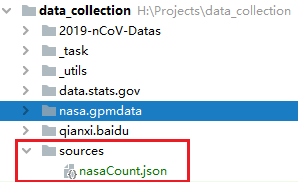
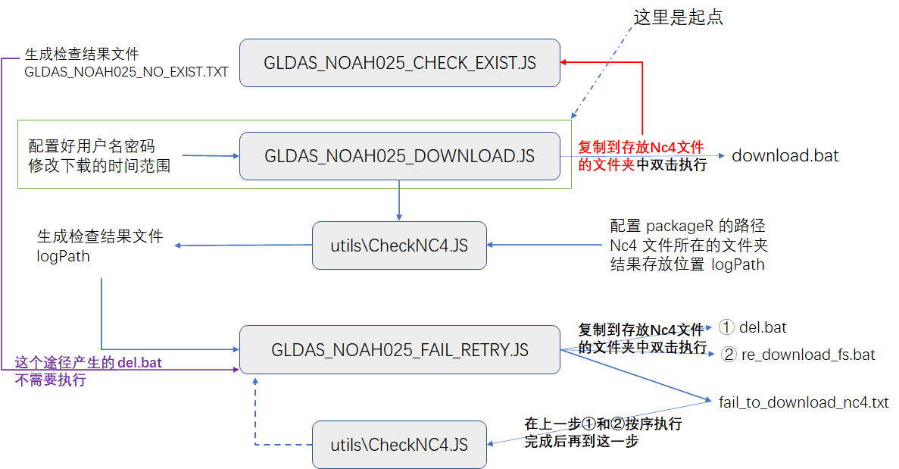

# 这个脚本是下载 土壤湿度的

[土壤湿度相关说明](https://disc.gsfc.nasa.gov/datasets/GLDAS_NOAH025_3H_2.1/summary?keywords=GLDAS_NOAH025_3H)

### 脚本1 ```GLDAS_NOAH025_DOWNLOAD.js``` 

是用于下载的，账号密码需要在最外层新建一个文件夹 ```resources``` 并在里面新建一个文件 ```nasaCount.json```

🔺注意：这个代码执行结束后会生成一个 ```bat``` 文件，把这个文件复制到要保存nc4文件的目录下后，双击执行即可

🔺注意：系统中需要有安装 ```wget```，其中 ```win10 19xx``` 后的版本自带 ```wget```

🔺注意：这里下载完成后需要经过 ```utils\CheckNC4.js``` 检查文件是否正常（无损坏）



```json
{
  "username": "用户名",
  "password": "密码"
}
```

其中脚本的内容是可以修改的，说明如下

```javascript
// line：7
// 下面这句话表示，生成一个 从 2003-2-1 到 2014-12-31 的日期迭代器
// 用于生产文件的路径和文件名
let nd = getFromDay(2003,2,1,false,true,2014,12,31);

// line:13、14
// 第一句表示下载的文件为 nc4 和 nc4.xml
// find 表示要下载的影像的当天时间，土壤湿度一天有 8 张
let ftype = ['nc4','nc4.xml'];
let find = ['0000','0300','0600','0900','1200','1500','1800','2100'];

// line:37
// 将 结果 保存到 download.bat
fs.writeFileSync('download.bat',"chcp 65001\r\n" + out.join('\r\n'),'utf-8');
```

### 脚本2 ```GLDAS_NOAH025_FAIL_RETRY.js```

是处理 ```utils\CheckNC4.js``` 生成的批处理执行完产生的 ```logPath``` 文件的

🔺注意：这个脚本执行结束后会生成 ```del.bat``` ```re_download_fs.bat``` ```fail_to_download_nc4.txt```

|文件|说明|
|----|----|
|del.bat|复制到下载 nc4 的文件夹中执行，将会删除下载失败的文件|
|re_download_fs.bat|复制到下载 nc4 的文件夹中，重新下载失败的文件|
|fail_to_download_nc4.txt|用于给 ```utils\CheckNC4.js``` 使用，检查重新下载的文件是否正常|

- logPath 文件格式如下，其中错误内容以 ```[check error]``` 开头

```text
xxxxxxxxxxxxxxxxxxxx
[check error] xxxxx\xxx.nc4
```

### 脚本3 ```GLDAS_NOAH025_CHECK_FILE_EXIST.js```

这个脚本的 配置 同 ```脚本1```

🔺注意：这个脚本执行结束后会生成 ```GLDAS_NOAH025_NO_EXIST.txt```，这个文件可以提供给 ```脚本2``` 使用

### 脚本4 ```NC4_READ_AS_TIF.js```

这个脚本用于从 nc4 中提取指定的层到 tif 文件中，看懂代码后自行配置

🔺注意：这个脚本执行结束后会生成 ```do.bat``` ，这个脚本在任意地方可以执行

# 最后的说明

[packageR](https://github.com/SunIBAS/data_collection/releases/tag/v1.0) 可以在项目的 release 中找到，并下载下来，这是一个 windows 应用，用到了 .Net Framework 4.7.2

如果在文件中看到 ```nc4Path``` 和 ```currentNC4Path``` 可以理解为 ```nc4Path``` 是 bat 脚本中的变量，因为我是在一个电脑生成bat脚本后复制到另一台电脑上执行的，而 ```currentNC4Path``` 是当前我要生成 bat 脚本的电脑访问的 nc4 文件夹的路径

